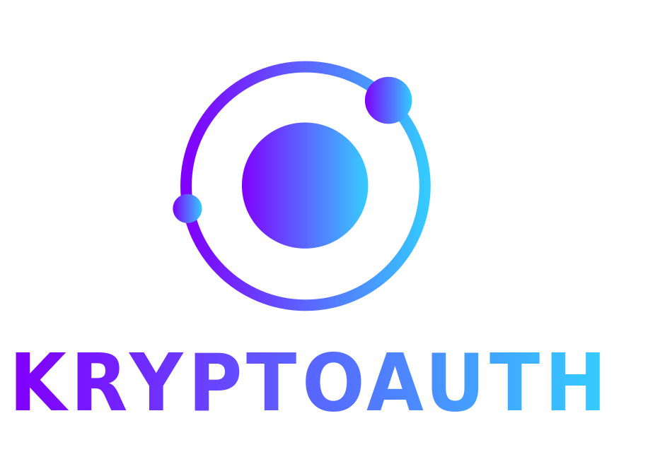

  

   
  Web DApp for secure Authentication.
   
  A project for my Bachelor's Degree in Computer Science  at University of Salerno.

<h1 dir="auto">
  <a id="user-content-project-description-and-introduction" class="anchor" aria-hidden="true" href="#project-description-and-introduction">
    <svg class="octicon octicon-link" viewBox="0 0 16 16" version="1.1" width="16" height="16" aria-hidden="true"><path fill-rule="evenodd" d="M7.775 3.275a.75.75 0 001.06 1.06l1.25-1.25a2 2 0 112.83 2.83l-2.5 2.5a2 2 0 01-2.83 0 .75.75 0 00-1.06 1.06 3.5 3.5 0 004.95 0l2.5-2.5a3.5 3.5 0 00-4.95-4.95l-1.25 1.25zm-4.69 9.64a2 2 0 010-2.83l2.5-2.5a2 2 0 012.83 0 .75.75 0 001.06-1.06 3.5 3.5 0 00-4.95 0l-2.5 2.5a3.5 3.5 0 004.95 4.95l1.25-1.25a.75.75 0 00-1.06-1.06l-1.25 1.25a2 2 0 01-2.83 0z">
      </path>
    </svg>
  </a>
  Project description and introduction
</h1>

In this section we introduce context informations for the project.

<h2 dir="auto">
  <a id="user-content-introduction" class="anchor" aria-hidden="true" href="#introduction"><svg class="octicon octicon-link" viewBox="0 0 16 16" version="1.1" width="16" height="16" aria-hidden="true">
    <path fill-rule="evenodd" d="M7.775 3.275a.75.75 0 001.06 1.06l1.25-1.25a2 2 0 112.83 2.83l-2.5 2.5a2 2 0 01-2.83 0 .75.75 0 00-1.06 1.06 3.5 3.5 0 004.95 0l2.5-2.5a3.5 3.5 0 00-4.95-4.95l-1.25 1.25zm-4.69 9.64a2 2 0 010-2.83l2.5-2.5a2 2 0 012.83 0 .75.75 0 001.06-1.06 3.5 3.5 0 00-4.95 0l-2.5 2.5a3.5 3.5 0 004.95 4.95l1.25-1.25a.75.75 0 00-1.06-1.06l-1.25 1.25a2 2 0 01-2.83 0z">
    </path>
    </svg>
  </a>
  Introduction
</h2>

  🎓 The Web DApp KryptoAuth is made with the aim of offering greater security during the authentication operation by exploiting the Ethereum Blockchain technology. The system allows any user to register and wait for a administrator gives him the permissions of "User" or "Admin" to carry out the operation of Login.

<h2 dir="auto">
  <a id="user-content-documentation" class="anchor" aria-hidden="true" href="#documentation">
    <svg class="octicon octicon-link" viewBox="0 0 16 16" version="1.1" width="16" height="16" aria-hidden="true">
      <path fill-rule="evenodd" d="M7.775 3.275a.75.75 0 001.06 1.06l1.25-1.25a2 2 0 112.83 2.83l-2.5 2.5a2 2 0 01-2.83 0 .75.75 0 00-1.06 1.06 3.5 3.5 0 004.95 0l2.5-2.5a3.5 3.5 0 00-4.95-4.95l-1.25 1.25zm-4.69 9.64a2 2 0 010-2.83l2.5-2.5a2 2 0 012.83 0 .75.75 0 001.06-1.06 3.5 3.5 0 00-4.95 0l-2.5 2.5a3.5 3.5 0 004.95 4.95l1.25-1.25a.75.75 0 00-1.06-1.06l-1.25 1.25a2 2 0 01-2.83 0z">
      </path>
    </svg>
  </a>
  Documentation
</h2>
<ul dir="auto">
<li>Project's javadoc can be found in <code>docs/javaDoc</code> directory and at the following link: <a href="https://alberto-00.github.io/Blockchain-Authentication/" rel="nofollow">Javadoc Link</a>.</li>
<li>Documentation can be found in <code>docs/deliverables</code> directory and at the following link: <a href="https://alberto-00.github.io/Blockchain-Authentication/" rel="nofollow">Documentation</a></li>
</ul>
<h1 dir="auto">
  <a id="user-content-technical-informations" class="anchor" aria-hidden="true" href="#technical-informations">
    <svg class="octicon octicon-link" viewBox="0 0 16 16" version="1.1" width="16" height="16" aria-hidden="true">
      <path fill-rule="evenodd" d="M7.775 3.275a.75.75 0 001.06 1.06l1.25-1.25a2 2 0 112.83 2.83l-2.5 2.5a2 2 0 01-2.83 0 .75.75 0 00-1.06 1.06 3.5 3.5 0 004.95 0l2.5-2.5a3.5 3.5 0 00-4.95-4.95l-1.25 1.25zm-4.69 9.64a2 2 0 010-2.83l2.5-2.5a2 2 0 012.83 0 .75.75 0 001.06-1.06 3.5 3.5 0 00-4.95 0l-2.5 2.5a3.5 3.5 0 004.95 4.95l1.25-1.25a.75.75 0 00-1.06-1.06l-1.25 1.25a2 2 0 01-2.83 0z">
      </path>
    </svg>
  </a>
  Technical informations
</h1>

Installation guide can be found in <code>docs/deliverables</code> directory and at the following link: <a href="https://github.com/Alberto-00/Blockchain-Authentication/blob/main/docs/deliverables/MDI.pdf" rel="nofollow">User manual</a>

<h2 dir="auto">
  <a id="user-content-built-with" class="anchor" aria-hidden="true" href="#built-with"><svg class="octicon octicon-link" viewBox="0 0 16 16" version="1.1" width="16" height="16" aria-hidden="true">
    <path fill-rule="evenodd" d="M7.775 3.275a.75.75 0 001.06 1.06l1.25-1.25a2 2 0 112.83 2.83l-2.5 2.5a2 2 0 01-2.83 0 .75.75 0 00-1.06 1.06 3.5 3.5 0 004.95 0l2.5-2.5a3.5 3.5 0 00-4.95-4.95l-1.25 1.25zm-4.69 9.64a2 2 0 010-2.83l2.5-2.5a2 2 0 012.83 0 .75.75 0 001.06-1.06 3.5 3.5 0 00-4.95 0l-2.5 2.5a3.5 3.5 0 004.95 4.95l1.25-1.25a.75.75 0 00-1.06-1.06l-1.25 1.25a2 2 0 01-2.83 0z">
    </path>
    </svg>
  </a>
  Built With
  </h2>
<ul dir="auto">
  <li><a href="https://spring.io/projects/spring-boot" rel="nofollow">Spring Boot</a> - Framework used to perform code development.</li>
  <li><a href="https://docs.soliditylang.org/en/v0.8.15/" rel="nofollow">Solidity</a> - Object-oriented, high-level language for implementing smart contracts.</li>
  <li><a href="https://docs.web3j.io/4.8.7/" rel="nofollow">Web3j</a> - Highly modular, reactive, type safe Java and Android library for working with Smart Contracts and integrating with clients on the Ethereum network.</li>
  <li><a href="https://web3js.readthedocs.io/en/v1.7.5/" rel="nofollow">Web3js</a> - A collection of libraries that allow you to interact with a local or remote ethereum node using HTTP, IPC or WebSocket.</li>
  <li><a href="https://trufflesuite.com/ganache/" rel="nofollow">Ganache</a> - Blockchain based on Ethereum.</li>
  <li><a href="https://metamask.io/" rel="nofollow">Metamask</a> - A crypto wallet & gateway to blockchain apps.</li>
  <li><a href="https://trufflesuite.com/" rel="nofollow">Truffle</a> - Development environment for Smart Contracts.</li>
  <li><a href="https://www.openzeppelin.com/" rel="nofollow">OpenZeppelin</a> - The standard for secure blockchain applications.</li>
</ul>

